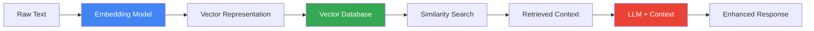
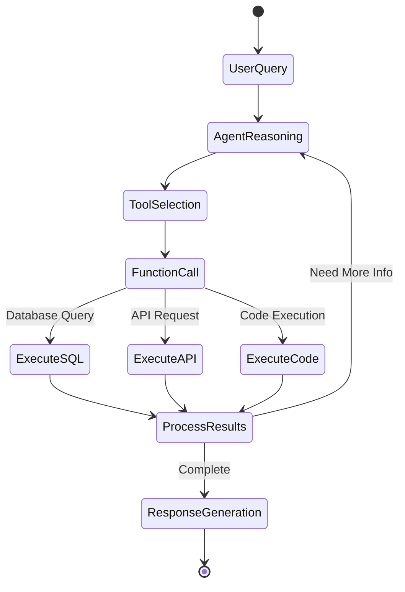
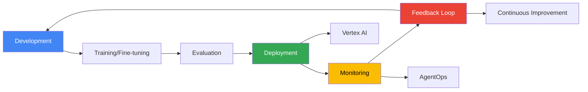
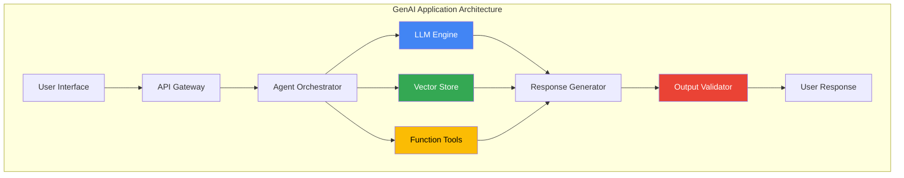

# 5-Day Gen AI Intensive Course with Google

[](https://www.kaggle.com/)
[]()
[](https://www.python.org/)
[]()

> A comprehensive deep-dive into Generative AI fundamentals, from foundational LLMs to production-ready MLOps practices. This repository documents my journey through Google's intensive 5-day course, featuring hands-on projects with Gemini 2.0 API, vector databases, AI agents, and more.

##  Table of Contents

** [Overview](#overview)
** [Course Architecture](#course-architecture)
** [Daily Breakdown](#daily-breakdown)
** [Projects & Implementations](#projects--implementations)
** [Technology Stack](#technology-stack)
** [Key Learnings](#key-learnings)
** [Setup & Installation](#setup--installation)
** [Resources](#resources)

##  Overview

This repository contains my complete work from Google's 5-Day Gen AI Intensive Course (March 31 - April 4, 2025). The course provided hands-on experience with cutting-edge generative AI technologies, covering everything from prompt engineering fundamentals to production MLOps workflows.

### Course Objectives

** Master foundational concepts of Large Language Models (LLMs)
** Implement advanced prompt engineering techniques
** Build production-ready RAG (Retrieval-Augmented Generation) systems
** Develop sophisticated AI agents with function calling
** Create domain-specific LLM applications
** Apply MLOps best practices for generative AI

## Course Architecture

```mermaid
graph TB
    A[5-Day Gen AI Intensive] --> B[Day 1: Foundations & Prompting]
    A --> C[Day 2: Embeddings & Vector DBs]
    A --> D[Day 3: AI Agents]
    A --> E[Day 4: Domain-Specific LLMs]
    A --> F[Day 5: MLOps]
    
    B --> B1[Transformer Architecture]
    B --> B2[Prompt Engineering]
    B --> B3[LLM Evaluation]
    
    C --> C1[Embedding Methods]
    C --> C2[Vector Search]
    C --> C3[RAG Systems]
    
    D --> D1[Function Calling]
    D --> D2[LangGraph Agents]
    D --> D3[Multi-Agent Systems]
    
    E --> E1[Model Fine-tuning]
    E --> E2[Google Search Integration]
    E --> E3[Custom Task Adaptation]
    
    F --> F1[GenAI MLOps]
    F --> F2[Vertex AI Tools]
    F --> F3[AgentOps]
    
    style A fill:#4285F4,color:#fff
    style B fill:#34A853,color:#fff
    style C fill:#FBBC04,color:#000
    style D fill:#EA4335,color:#fff
    style E fill:#9334E9,color:#fff
    style F fill:#FF6D00,color:#fff
```



## 📚 Daily Breakdown

### Day 1: Foundational Models & Prompt Engineering

**Focus**: Understanding LLM evolution and mastering prompt engineering techniques

**Topics Covered**:
** Transformer architecture and attention mechanisms
** Fine-tuning strategies and inference acceleration
** Advanced prompt engineering patterns
** LLM evaluation using autoraters
** Structured output generation

**Projects**:
1. **Prompting Fundamentals Lab**
   ** Explored various prompt techniques with Gemini 2.0 API
   ** Experimented with temperature, top-p, and top-k parameters
   ** Implemented few-shot and chain-of-thought prompting

2. **Evaluation & Structured Data Lab**
   ** Built automated evaluation systems for LLM responses
   ** Created structured output parsers
   ** Implemented autorater metrics

**Key Technologies**: Gemini 2.0 API, Python, Google AI Studio

### Day 2: Embeddings and Vector Stores/Databases

**Focus**: Leveraging embeddings for semantic search and classification

**Topics Covered**:
** Mathematical foundations of embeddings
** Vector similarity metrics (cosine, euclidean, dot product)
** Vector database architectures and indexing
** Embedding evaluation techniques



**Projects**:
1. **RAG Question-Answering System**
   ** Built end-to-end RAG pipeline over custom documents
   ** Implemented chunking strategies and retrieval optimization
   ** Integrated with Gemini for context-aware responses

2. **Text Similarity Explorer**
   ** Analyzed semantic relationships using embeddings
   ** Visualized high-dimensional vectors with dimensionality reduction
   ** Compared different embedding models

3. **Neural Classification Network**
   ** Developed text classifier using Keras
   ** Leveraged pre-trained embeddings as features
   ** Achieved competitive accuracy on classification tasks

**Key Technologies**: Vector Databases, Embedding APIs, Keras, NumPy, scikit-learn

### Day 3: Generative AI Agents

**Focus**: Building autonomous AI agents with tool-use capabilities

**Topics Covered**:
** Agent architecture and planning strategies
** Function calling and tool integration
** LangGraph framework for agent orchestration
** Multi-agent coordination patterns
** Agent evaluation methodologies



**Projects**:
1. **Database Chatbot with Function Calling**
   * Implemented SQL query generation from natural language
   * Integrated Gemini 2.0's Live API for real-time interactions
   * Built error handling and query validation

2. **LangGraph Café Ordering Agent**
   * Created multi-turn conversational agent
   * Implemented state management with LangGraph
   * Developed order processing and confirmation workflows

**Key Technologies**: LangGraph, Gemini 2.0 Live API, Function Calling, SQL

### Day 4: Domain-Specific LLMs

**Focus**: Adapting LLMs for specialized domains

**Topics Covered**:
* Domain adaptation strategies
* Fine-tuning techniques for custom tasks
* SecLM (Security LLM) and Med-PaLM case studies
* Google Search integration for real-time data
* Model evaluation for domain-specific performance

**Projects**:
1. **Custom Gemini Model Fine-tuning**
   * Prepared labeled dataset for specific task
   * Fine-tuned Gemini model using Vertex AI
   * Evaluated performance against base model

2. **Google Search Enhanced Generation**
   * Integrated real-time Google Search data
   * Built visualization tools for search results
   * Implemented fact-checking mechanisms

**Key Technologies**: Vertex AI, Model Fine-tuning, Google Search API, Data Visualization

### Day 5: MLOps for Generative AI

**Focus**: Production-ready GenAI systems and operational excellence

**Topics Covered**:
* MLOps principles adapted for generative AI
* Vertex AI tools for foundation models
* AgentOps for agentic applications
* Monitoring and observability
* Continuous evaluation and improvement



**Key Resources**:
* Agent Starter Pack exploration
* Production deployment best practices
* Model monitoring and versioning strategies

**Key Technologies**: Vertex AI, MLOps Tools, AgentOps, CI/CD Pipelines

## 💻 Projects & Implementations

### Project Summary

| Day | Project | Description | Technologies |
|-----|---------|-------------|--------------|
| 1 | Prompt Engineering Suite | Advanced prompting techniques and evaluation | Gemini 2.0, Python |
| 2 | RAG QA System | Document retrieval and question answering | Embeddings, Vector DB |
| 2 | Text Classifier | Neural network with embedding features | Keras, TensorFlow |
| 3 | SQL Chatbot | Natural language to database queries | Function Calling, SQL |
| 3 | Ordering Agent | Multi-turn conversational agent | LangGraph, State Management |
| 4 | Custom Model Fine-tuning | Domain-specific model adaptation | Vertex AI, Fine-tuning |
| 4 | Search-Enhanced Generator | Real-time data integration | Google Search API |

## 🛠️ Technology Stack

### Core Technologies
* **LLM**: Gemini 2.0 API
* **Frameworks**: LangGraph, Keras, TensorFlow
* **Databases**: Vector Databases (Pinecone/ChromaDB)
* **Cloud**: Google Vertex AI, Google AI Studio
* **Languages**: Python 3.8+

### Libraries & Tools
```python
# Key dependencies
google-generativeai>=0.3.0
langchain>=0.1.0
langgraph>=0.0.20
keras>=3.0.0
tensorflow>=2.14.0
numpy>=1.24.0
pandas>=2.0.0
chromadb>=0.4.0
```

## 🎓 Key Learnings

### Technical Skills Acquired

1. **Prompt Engineering Mastery**
   ** Zero-shot, few-shot, and chain-of-thought prompting
   ** Parameter tuning (temperature, top-p, top-k)
   ** Structured output generation and validation

2. **Vector Database Proficiency**
   ** Embedding generation and optimization
   ** Similarity search algorithms (ANN, HNSW)
   ** RAG pipeline architecture and implementation

3. **AI Agent Development**
   ** Function calling and tool integration
   ** State management in conversational AI
   ** Multi-agent coordination patterns

4. **Model Customization**
   ** Fine-tuning strategies for domain adaptation
   ** Transfer learning best practices
   ** Model evaluation and benchmarking

5. **Production MLOps**
   ** Deployment pipelines for GenAI applications
   ** Monitoring and observability frameworks
   ** Continuous evaluation and improvement loops

### Architectural Patterns



## 🚀 Setup & Installation

### Prerequisites
** Python 3.8 or higher
** Kaggle account (phone verified)
** Google AI Studio account with API key
** Git

### Installation Steps

1. **Clone the repository**
```bash
git clone https://github.com/eaamankwah/genai-intensive-course-with-google.git
cd 5day-genai-intensive
```

2. **Create virtual environment**
```bash
python -m venv venv
source venv/bin/activate  # On Windows: venv\Scripts\activate
```

3. **Install dependencies**
```bash
pip install -r requirements.txt
```

4. **Configure API keys**
```bash
# Create .env file
cp .env.example .env

# Add your API keys
GOOGLE_API_KEY=your_api_key_here
KAGGLE_USERNAME=your_username
KAGGLE_KEY=your_kaggle_key
```

5. **Run notebooks**
```bash
jupyter notebook
# Navigate to the day-specific folder and open notebooks
```

## 📂 Repository Structure

```
5day-genai-intensive/
│
├── day1-foundations/
│   ├── prompting_fundamentals.ipynb
│   ├── evaluation_structured_data.ipynb
│   └── README.md
│
├── day2-embeddings/
│   ├── rag_qa_system.ipynb
│   ├── text_similarity.ipynb
│   ├── neural_classifier.ipynb
│   └── README.md
│
├── day3-agents/
│   ├── database_chatbot.ipynb
│   ├── langgraph_ordering_agent.ipynb
│   └── README.md
│
├── day4-domain-specific/
│   ├── model_finetuning.ipynb
│   ├── search_integration.ipynb
│   └── README.md
│
├── day5-mlops/
│   ├── agent_starter_pack/
│   └── README.md
│
├── resources/
│   ├── whitepapers/
│   └── case_studies/
│
├── .env.example
├── requirements.txt
├── LICENSE
└── README.md
```

## 📖 Resources

### Official Course Materials
** [Course Registration](https://rsvp.withgoogle.com/events/google-ai-agents-intensive_2025)
** [Kaggle Notebooks](https://www.kaggle.com/)
** [Google AI Studio](https://aistudio.google.com/)
** [NotebookLM](https://notebooklm.google.com/)

### Additional Learning
** [Gemini API Documentation](https://ai.google.dev/)
** [Vertex AI Documentation](https://cloud.google.com/vertex-ai/docs)
** [LangGraph Documentation](https://python.langchain.com/docs/langgraph)
** [Agent Starter Pack](https://goo.gle/agent-starter-pack)

### Research Papers
** Attention Is All You Need (Transformers)
** Retrieval-Augmented Generation for Knowledge-Intensive Tasks
** ReAct: Synergizing Reasoning and Acting in Language Models

## Contributing

While this is a personal learning repository, suggestions and discussions are welcome! Feel free to:
** Open issues for questions or clarifications
** Submit pull requests for improvements
** Share your own implementations and learnings

## License

This project is licensed under the MIT License - see the [LICENSE](LICENSE) file for details.

##  Acknowledgments

Special thanks to the Google team and course instructors:
  **Anant Nawalgaria** - Course Lead
  **Antonio Gulli** - Technical Content
  **Mark McDonald** - Curriculum Design
  **Polong Lin** - Developer Relations
  **Paige Bailey** - AI/ML Advocate

And all the expert speakers who contributed to making this course exceptional.

## Connect

  **GitHub**: [@Edward Amankwah](https://github.com/eaamankwah)
  **LinkedIn**: 
  **Kaggle**: 
  **Discord**: Join the [Kaggle Discord](https://kaggle.com/discord/confirmation)

---

**Star this repository** if you found it helpful!

**Course Completion Date**: April 4, 2025 | **Status**: ✅ Completed
